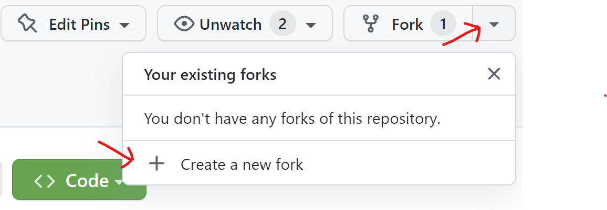
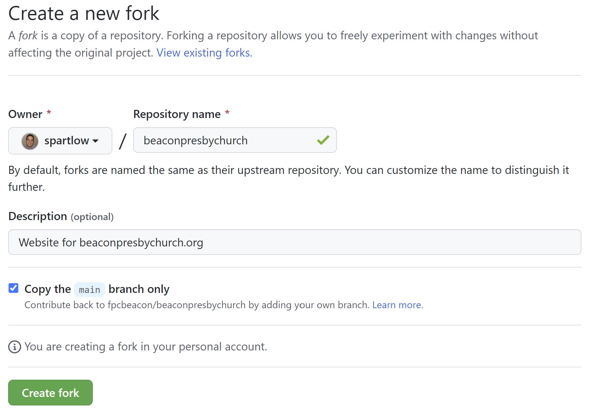
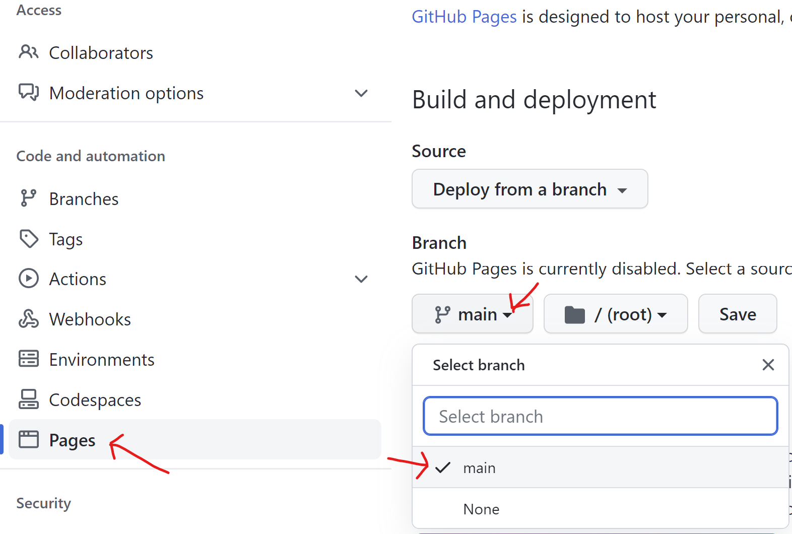
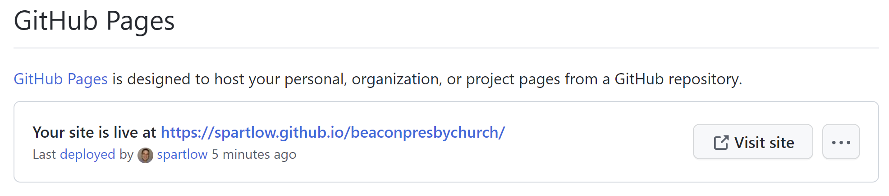

# How to Create a Fork and Test Updates

In Github a "fork" is a separate copy of a repository. 
You can think of it as your own sandbox where you can try anything out and copy it back when you're happy.

## Create Fork

Click on drop down arround next to "Fork" on the top right of the page. Then select "Create a new fork".

Next you should be able to take the defaults and click the "Create fork" button.

## Setup Pages

Once you have your fork, you'll need to set up the web page feature.

To do that click on the "Settings" tab near the top.
Next select "Pages" from the left menu. 
From here change the branch from "None" to "main.
Then click "Save".

It then starts building your web page.
This may take a couple minutes.
When it's down you can refresh that page and it will show you where your private site is located.
Click on "View site" to view it.

## Make Changes

Now you can edit files as much as you like and not worry about breaking the live site.
Just be sure to the top left has your name and not `fpcbeacon / beaconpresbychurch` which is the live site.

## Merging Back to Live Site

Coming soon...

