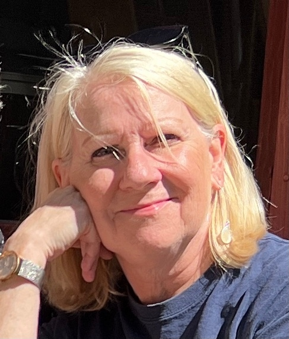

{: .float-right}

I am sustained by the deep sense of God’s abiding presence and am grateful for the gift of serving a church where adventure is possible, all are welcome, and asking questions and trying new things are an authentic part of the journey. I, along with my fellow travelers in faith, make our way in a broken world, with a heart for social justice as we continue to embody acts of love, grace, and kindness as the hands and feet of Christ in the world.  I love to study Scripture where I continually find joy and new depths of understanding, for I believe that God’s words are for all times and places. Sharing the challenge and the comfort of Jesus Christ is the fascinating and daunting calling for me as I walk beside these people of compassion, as we strive to encounter God, build bridges, and heal lives through the love and grace of Jesus Christ.

Our congregation reminds me of the early church. We care for one another and those who join us as we gather for worship each Sunday. Seasonally, we offer the sanctuary for evening Quiet Church, and we come together for Brunch Worship on the third Sunday of the month where we bring and share food and soul food. Our services are warm, welcoming, and relaxed, and children are valued and have a prominent place as we continue to explore new ways to be the church both inside and outside our walls. 

I have 4 adult children and 4 grandkiddos who light up my life.  I enjoy the arts, reading a good book, studying theology, walking by the water, biking, good food and great conversations. I have a pooch named Priscilla who keeps me out and walking, and I am enjoying the charming town of Beacon and all it has to offer.

And I am open for coffee and getting to know anyone who is interested in getting to know us. Give a call to the church and we can set something up! Church Office: 845 831 5322

_Rev Eileen was ordained into ministry in the Presbyterian Church (USA) in 2007, after graduating from Princeton Theological Seminary. She received her   doctoral degree in Transformational Ministry with a focus on Worship and the Arts, her dissertation entitled, Windows into the Holy: The Arts for   Preaching and Worship from a Biblical, Reformed Perspective, from Colgate Rochester Crozer Divinity School in Rochester, New York.  She has served   multiple churches in New York after spending a year serving Troon Parish Church in Troon, Scotland, where she experienced church from a loving Scottish   church community, expanding her vision of the community Christ calls us to be._

Beacon First Presbyterian Church 
50 Liberty Street 
Beacon, New York, 12508 
Church Phone: 845 831 5322 
Email: office@beaconpresbychurch.org 
